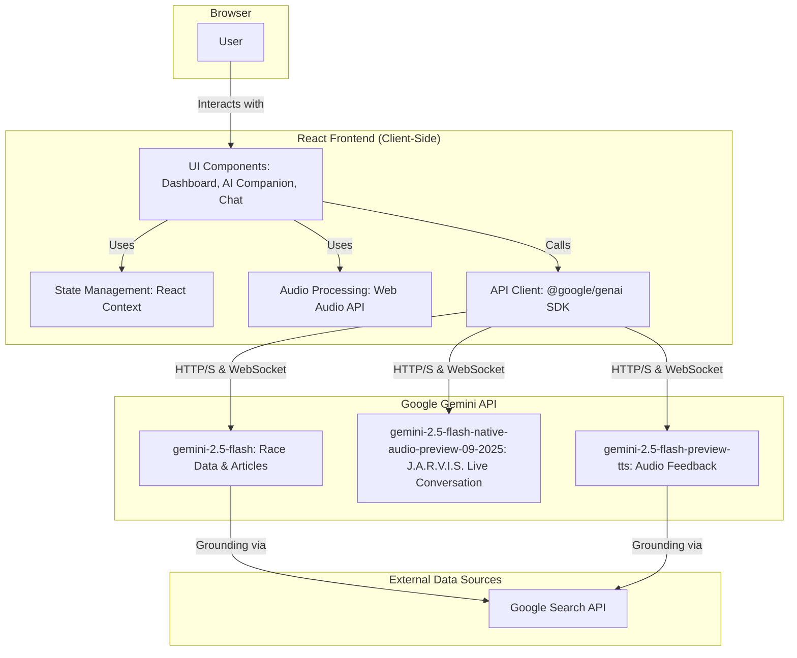

# 🐎 Horse Racing Analytics AI

[![React Version][react-badge]][react-url]
[![TypeScript][typescript-badge]][typescript-url]
[![License: MIT][license-badge]][license-url]

An advanced, AI-powered web application providing real-time predictions, deep analysis, and a voice-native conversational AI companion for global horse racing. This project leverages the full power of the Google Gemini API suite to deliver a cutting-edge user experience.

---

## ✨ Key Features

-   **🔮 Real-time Race Predictions**: Fetches and displays upcoming races with AI-generated confidence scores for each horse, grounded in real-world data via Google Search.
-   **🎙️ J.A.R.V.I.S. AI Voice Companion**: A state-of-the-art, voice-native conversational AI powered by the Gemini Live API. Engage in natural, low-latency conversations for deep race analysis.
-   **💬 AI Chatbot**: A text-based chat interface for users to ask general questions about horse racing history, terminology, and famous events.
-   **📰 AI-Generated Racing News**: An articles section where the Gemini model acts as a journalist, finding and summarizing the latest horse racing news from around the globe.
-   **🔊 Dynamic Audio Feedback**: Real-time voice announcements for fluctuating odds, powered by Gemini's Text-to-Speech model.
-   **🎤 Voice Commands**: Control the user interface with voice commands, such as "refresh data", enabled by the browser's Speech Recognition API.
-   **🌓 Light/Dark Mode**: A sleek, modern UI with theme persistence across sessions.
-   **📱 Fully Responsive**: A seamless experience across desktop, tablet, and mobile devices, built with Tailwind CSS.

---

## 🏛️ System Architecture

This application follows a modern client-side architecture where the React frontend communicates directly and securely with the Google Gemini API. This serverless approach simplifies deployment and scaling.



---

## 🛠️ Technology Stack

-   **Framework**: [React](https://reactjs.org/)
-   **Language**: [TypeScript](https://www.typescriptlang.org/)
-   **AI & Backend**: [Google Gemini API](https://ai.google.dev/)
    -   **`generateContent`**: Used for race predictions, news articles, and the text chatbot, with Google Search grounding.
    -   **`live.connect`**: Powers the real-time, bidirectional audio stream for the J.A.R.V.I.S. companion, including transcriptions and function calling.
    -   **TTS Model**: Used for dynamic voice feedback.
-   **Styling**: [Tailwind CSS](https://tailwindcss.com/)
-   **Audio**: Browser [Web Audio API](https://developer.mozilla.org/en-US/docs/Web/API/Web_Audio_API) & [Speech Recognition API](https://developer.mozilla.org/en-US/docs/Web/API/SpeechRecognition)

---

## 🚀 Getting Started

Follow these instructions to get a copy of the project up and running on your local machine for development and testing purposes.

### Prerequisites

-   Node.js (v18 or later)
-   npm or yarn
-   A valid Google Gemini API Key.

### Installation & Setup

1.  **Clone the repository:**
    ```bash
    git clone https://github.com/your-username/horse-racing-analytics-ai.git
    cd horse-racing-analytics-ai
    ```

2.  **Install dependencies:**
    ```bash
    npm install
    ```

3.  **Set up environment variables:**
    This project is configured to use an `API_KEY` that is expected to be available in the execution environment (`process.env.API_KEY`). The application framework handles the injection of this key. Ensure it is configured in your hosting or development environment.

4.  **Run the development server:**
    ```bash
    npm run dev
    ```
    The application will be available at `http://localhost:5173` (or another port if 5173 is in use).

---

## 🧠 Key Gemini API Integrations

This project is a showcase of various Gemini API capabilities:

1.  **Grounded Generation (`generateContent`)**
    -   **Feature**: Real-time Race Predictions & Articles.
    -   **Implementation**: The `fetchRealtimeRaces` and `fetchRacingArticles` functions use `gemini-2.5-flash` with the `tools: [{ googleSearch: {} }]` configuration. This grounds the model's responses in up-to-date information from the web, ensuring the race data and news are current and accurate. A robust JSON parsing utility (`extractJsonFromMarkdown`) handles the model's structured output.

2.  **Conversational AI (`live.connect`)**
    -   **Feature**: J.A.R.V.I.S. AI Voice Companion.
    -   **Implementation**: This feature establishes a persistent, low-latency WebSocket connection to the `gemini-2.5-flash-native-audio-preview-09-2025` model.
        -   **Bidirectional Audio Streaming**: The app captures microphone input using the Web Audio API, encodes it to raw PCM format, and streams it to the model. It simultaneously receives audio from the model, decodes it, and plays it back for a seamless conversational flow.
        -   **Live Transcription**: Both user and model speech are transcribed in real-time, providing a visual log of the conversation.
        -   **Function Calling**: The model can trigger client-side functions, like `refresh_race_data`, allowing the AI to interact with the application's state.

3.  **Text-to-Speech (`generateContent` with `Modality.AUDIO`)**
    -   **Feature**: Voice Feedback for Odds Changes.
    -   **Implementation**: The `speak` utility function in `lib/audio.ts` sends text to the `gemini-2.5-flash-preview-tts` model and receives raw audio data back. This allows for dynamic, on-the-fly generation of voice announcements directly in the browser.

---

## 📄 License

This project is licensed under the MIT License - see the [LICENSE.md](LICENSE.md) file for details.

[react-badge]: https://img.shields.io/badge/React-19-blue?style=for-the-badge&logo=react
[react-url]: https://reactjs.org/
[typescript-badge]: https://img.shields.io/badge/TypeScript-5.x-blue?style=for-the-badge&logo=typescript
[typescript-url]: https://www.typescriptlang.org/
[license-badge]: https://img.shields.io/badge/License-MIT-green?style=for-the-badge
[license-url]: https://opensource.org/licenses/MIT
